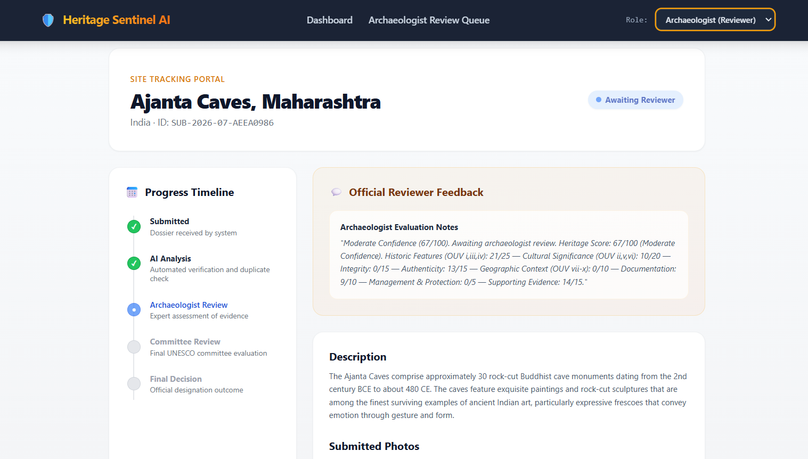
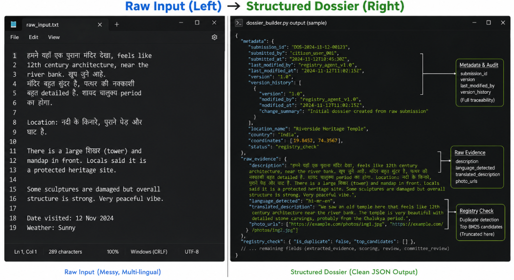
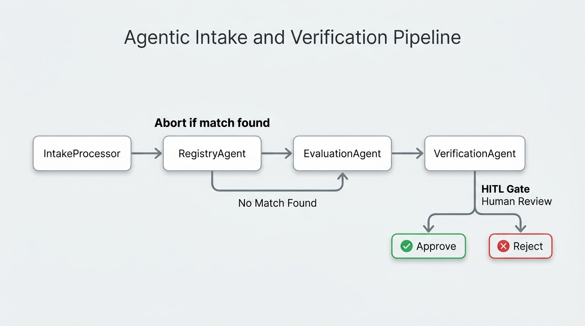
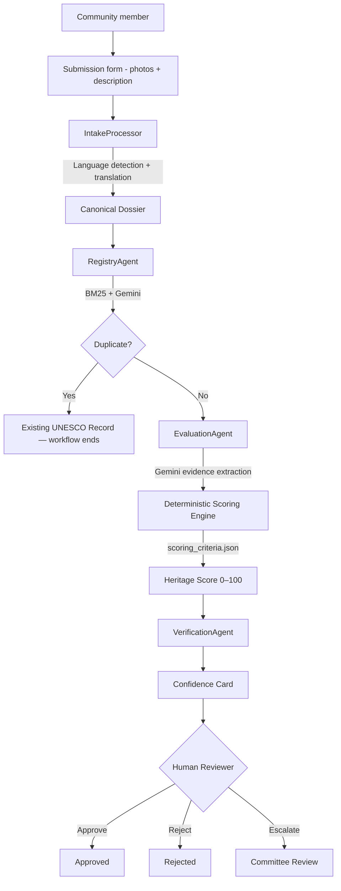

# Heritage Sentinel AI


[](LICENSE)

**Preserving what humanity cannot rebuild — with multi-agent AI.** Heritage Sentinel AI is a multi-agent system that helps archaeologists and heritage experts review potential UNESCO World Heritage Site submissions faster. Community members submit photos and descriptions of candidate sites. Three sequential AI agents process each submission and present a structured Confidence Card to a human expert who makes the final decision.

## Links

- **Repository:** [github.com/sriyaa-p/heritage-vanguards](https://github.com/sriyaa-p/heritage-vanguards)

> **Human-in-the-loop notice:** Heritage Sentinel AI is a decision-support tool for heritage experts. It does **not** autonomously designate heritage status. All final decisions remain with human reviewers. The system processes community submissions into structured, explainable dossiers — it does not replace expert archaeological judgment.

## Problem

Cultural heritage sites are frequently lost before they are formally documented. Researchers estimate that a significant number of archaeological and culturally important sites remain undocumented worldwide. When a community identifies a candidate site, heritage experts face hours of manual work before they can answer basic operational questions:

- Is this site already in the UNESCO registry?
- What evidence supports its heritage significance?
- Which evaluation criteria does the submission satisfy?
- What is the overall confidence level for this candidate?
- Which source evidence supports each scoring dimension?

Heritage Sentinel AI turns that fragmented review process into a structured, traceable Confidence Card while preserving the source evidence behind every accepted claim.

## Why a multi-agent system

The problem crosses distinct heritage-evaluation domains. A single general-purpose prompt would either receive excessive tool access or mix unrelated reasoning into one opaque response. Heritage Sentinel AI instead assigns narrowly scoped responsibilities to specialist agents that work sequentially:

- **Intake Processor** handles language detection and translation, converting raw multilingual submissions into a normalized Canonical Dossier.
- **RegistryAgent** performs BM25 retrieval and Gemini-powered duplicate detection against the UNESCO World Heritage Sites dataset.
- **EvaluationAgent** extracts structured evidence across 8 UNESCO-aligned dimensions — Gemini acts only as an evidence extractor; a deterministic scoring engine assigns all numeric scores.
- **VerificationAgent** generates a Confidence Card with threshold-based routing, pausing for human reviewer action before any decision is finalized.

The agents use purpose-built tools, write to a shared Canonical Dossier, and are followed by deterministic scoring. The human reviewer makes the final approve or reject decision.

## How the pipeline works

> **A community member submits a candidate heritage site. What happens next?**

| Stage | What happens | Output |
|---|---|---|
| **Intake** | Language detected (lingua), translated to English (Gemini), normalized into Canonical Dossier | Structured dossier |
| **Registry Check** | BM25/FTS + SQL search against ~1 200 UNESCO sites, Gemini duplicate comparison | Match status + top candidates |
| **Evaluation** | Gemini extracts evidence across 8 categories; deterministic scorer assigns points | Heritage Score (0–100) + category breakdown |
| **Verification** | Threshold routing: auto-reject junk (<25), route genuine submissions to reviewer queue | Confidence Card for human review |
| **Human Review** | Archaeologist reviews Confidence Card → approve, reject, or escalate to committee | Final decision |

The final Confidence Card contains the Heritage Score, category breakdown, confidence level, and evidence summary — everything a reviewer needs in one view.




## Architecture





## Agent descriptions

| Agent | Responsibility | Tool access |
|---|---|---|
| `IntakeProcessor` | Language detection (lingua), translation (Gemini), Canonical Dossier creation | Lingua, Gemini |
| `RegistryAgent` | BM25 retrieval against UNESCO dataset, SQL search, Gemini duplicate comparison | BM25, PostgreSQL FTS, Gemini |
| `EvaluationAgent` | Structured evidence extraction across 8 UNESCO-aligned categories | Gemini (extraction only) |
| `ScoringEngine` | Deterministic keyword-based scoring using `scoring_criteria.json` — identical inputs always produce identical scores | None (deterministic) |
| `VerificationAgent` | Threshold routing, Confidence Card generation, human-in-the-loop gate | None |

## Scoring system

The scoring engine is fully calibrated to align with the official UNESCO Operational Guidelines (WHC.25/01) across 8 dimensions. Gemini extracts evidence only — the deterministic scoring engine assigns all numeric scores.

| Category | Max Points |
|---|---|
| Historic Features | 25 |
| Cultural Significance | 20 |
| Integrity | 15 |
| Authenticity | 15 |
| Geographic Context | 10 |
| Documentation Quality | 10 |
| Management & Protection | 5 |
| Supporting Evidence | 15 |
| **Total** | **100** |

**Confidence levels:** Low (< 60) · Moderate (60–79) · High (80–100)

## Technology stack

| Layer | Technology |
|---|---|
| Backend | Python 3.11, FastAPI, Uvicorn |
| AI | Gemini 2.5 Flash (`google-generativeai`, `google-adk`) |
| Database | PostgreSQL 16, SQLAlchemy 2.0, Alembic |
| Search & Retrieval | BM25 (`rank-bm25`), FAISS (`faiss-cpu`), `sentence-transformers` |
| Language Detection | `lingua-language-detector` |
| Frontend | Next.js 14, Tailwind CSS, TypeScript |
| Infrastructure | Docker Compose, Nginx |
| Dataset | UNESCO World Heritage Sites (~1 200 sites) |

## Getting started

### Prerequisites

- [Docker](https://docs.docker.com/get-docker/) and [Docker Compose](https://docs.docker.com/compose/install/)
- A [Google AI API key](https://aistudio.google.com/app/apikey) (Gemini 2.5 Flash)

### Installation

```bash
# 1. Clone the repository
git clone https://github.com/sriyaa-p/heritage-vanguards.git
cd heritage-vanguards

# 2. Copy the environment template and fill in your values
cp .env.example .env
# Edit .env — at minimum, set GEMINI_API_KEY

# 3. Start the full stack
docker compose up
```

This starts four services:
- **PostgreSQL** on `localhost:5432` (health-checked before backend starts)
- **Backend** on port `8000` (FastAPI + Uvicorn)
- **Frontend** on port `3000` (Next.js)
- **Nginx** on `localhost:80` (reverse proxy)

On startup, the backend container automatically:
1. Runs `alembic upgrade head` — applies all pending migrations
2. Runs `fetch_unesco_data.py` — fetches the UNESCO XML dataset
3. Runs `seed_database.py` — upserts ~1 200 UNESCO sites into PostgreSQL
4. Starts the Uvicorn server

### Running tests

Tests use SQLite in-memory — no PostgreSQL required:

```bash
# From repo root (outside Docker)
pytest

# Inside the Docker container
docker compose exec backend pytest /tests
```

## Usage

### Submit a candidate site (JSON)

```bash
curl -X POST http://localhost:8000/submissions \
  -H 'Content-Type: application/json' \
  -d '{
    "location_name": "Ancient Temple Complex",
    "country": "India",
    "description": "A 12th-century temple complex featuring intricate stone carvings..."
  }'
```

### Submit with photos (multipart)

```bash
curl -X POST http://localhost:8000/submissions/with-photos \
  -F 'location_name=Ancient Temple Complex' \
  -F 'country=India' \
  -F 'description=A 12th-century temple complex...' \
  -F 'files=@photo1.jpg' \
  -F 'files=@photo2.jpg'
```

### Check submission status

```bash
# List all submissions
curl http://localhost:8000/submissions

# Get detail for a specific submission
curl http://localhost:8000/submissions/SUB-2026-07-ABCD1234

# Dashboard stats
curl http://localhost:8000/submissions/stats
```

### Reviewer decision

```bash
curl -X PATCH http://localhost:8000/submissions/SUB-ID/review \
  -H 'Content-Type: application/json' \
  -d '{"decision": "committee_review", "notes": "Looks promising"}'
```

### Committee finalization

```bash
curl -X PATCH http://localhost:8000/submissions/SUB-ID/finalize \
  -H 'Content-Type: application/json' \
  -d '{"decision": "approved", "comments": "Meets UNESCO criteria"}'
```

## Configuration

Copy `.env.example` to `.env` and set the following variables:

| Variable | Purpose | Default |
|---|---|---|
| `POSTGRES_USER` | Database username | `heritage_user` |
| `POSTGRES_PASSWORD` | Database password | `heritage_pass` |
| `POSTGRES_DB` | Database name | `heritage_db` |
| `GEMINI_API_KEY` | Google AI API key | *(required)* |
| `ENV` | Environment mode (`development` / `production`) | `development` |
| `UPLOADS_DIR` | Photo storage path | `/data/uploads` |

> In `development` mode with no PostgreSQL credentials, the backend automatically falls back to SQLite in-memory. Missing `GEMINI_API_KEY` in dev mode uses a dummy key — agents won't make real Gemini calls, but imports and tests still work.

## Repository structure

```
heritage-vanguards/
├── backend/                # FastAPI app, agents, models, API routes
│   ├── app/
│   │   ├── agents/         # Pipeline agents + scoring engine
│   │   ├── api/routes/     # REST endpoints
│   │   ├── core/           # Pydantic Settings config
│   │   ├── db/             # Async SQLAlchemy engine + session
│   │   └── models/         # Pydantic domain models + SQLAlchemy ORM
│   ├── Dockerfile
│   └── main.py             # FastAPI app factory
├── frontend/               # Next.js 14 + Tailwind CSS + TypeScript
│   └── src/
│       ├── app/            # App Router pages (submit, dashboard, review, committee)
│       ├── components/     # Shared UI components
│       └── lib/            # API client
├── data/
│   ├── scoring_criteria.json   # UNESCO-aligned rubric (8 categories)
│   ├── processed/              # Cleaned UNESCO dataset (~1 200 sites)
│   └── uploads/                # Photo uploads per submission
├── scripts/                # fetch_unesco_data.py, seed_database.py
├── tests/                  # Pytest suite (async, SQLite in-memory)
├── nginx/                  # Nginx reverse proxy config
├── docker-compose.yml      # Full-stack orchestration
├── .env.example            # Environment variable template
└── requirements.txt        # Python dependencies
```

## Contributing

1. **Never commit directly to `main`** — always create a branch.
2. Branch naming: `<your-name>-<short-description>` (e.g., `sriya-database-schema`).
3. PR title format: `<Short description> - <Your Name>`.
4. Always assign **sriyaa-p** as reviewer.
5. Never merge your own PR — wait for review and approval.

### Quick start for new contributors

```bash
git clone https://github.com/sriyaa-p/heritage-vanguards.git
cd heritage-vanguards
cp .env.example .env            # fill in your values
docker compose up               # start the full stack
git checkout -b yourname-what-you-are-doing
# make changes, push, and open a PR
```

## Team

| Name | GitHub |
|---|---|
| Sriya | [sriyaa-p](https://github.com/sriyaa-p) (repo owner) |
| Aishwarya Bhangarshettra | [Aishwarya29121994](https://github.com/Aishwarya29121994) |
| Rujul | [rujpuj](https://github.com/rujpuj) |
| Ujjwal | [Ujjwal01080](https://github.com/Ujjwal01080) |
| Sanjana | [sanjanap19](https://github.com/sanjanap19) |

## License

This project is licensed under the [MIT License](LICENSE).

---

*Heritage Sentinel AI — Agents Intensive Capstone Project · Hackathon MVP · July 2026*
